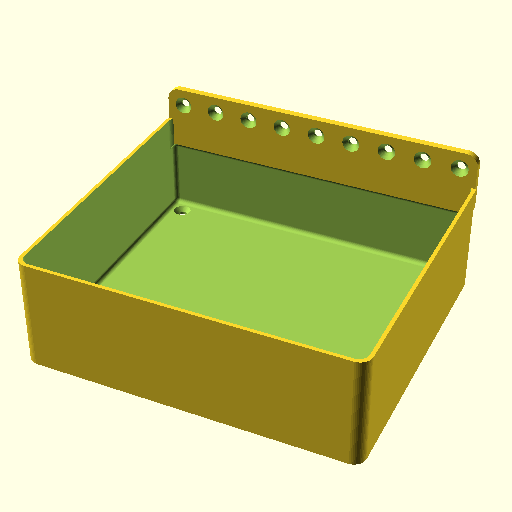

# tray_vertical  

note: This is part of OOMP the Oopen Organization Method For Parts. For more details: https://github.com/oomlout/oomp_base

##  part details
  

### name
* name: tray_vertical
* name_short: 
### id
* oomp_id: oobb_part_tray_vertical_9_width_8_height_45_mm_depth_countersunk_extra
  * classification: oobb
  * type: part
  * size: tray_vertical
  * color: 
  * description_main: 9_width_8_height_45_mm_depth
  * description_extra: countersunk_extra
  * manufacturer: 
  * part_number: 
  * bip 39 word 2: 
  * bip 39 word 3: 
  * bip 39 word: 

### other_codes
* short_code: 
* oomp_word: 
* oomp_word_emoji 
* md5_6_alpha: 
* md5_6: 

### all codes 
| key | value |  
| --- | --- |  
| classification | oobb |  
| color |  |  
| description_extra | countersunk_extra |  
| description_main | 9_width_8_height_45_mm_depth |  
| full_rotations | [0, 0, 0] |  
| full_shift | [0, 0, 0] |  
| id | oobb_part_tray_vertical_9_width_8_height_45_mm_depth_countersunk_extra |  
| id_oobb | oobb_part_oomlout_oobb_part_tray_vertical_tray_vertical_9_width_8_height_45_mm_depth_countersunk_extra |  
| kwargs | {'extra': 'countersunk', 'filter': '', 'height': 8, 'modes': ['3dpr'], 'navigation': True, 'oomp_classification': 'oobb', 'oomp_color': '', 'oomp_description_extra': 'countersunk_extra', 'oomp_description_main': '9_width_8_height_45_mm_depth', 'oomp_manufacturer': '', 'oomp_mode': 'oobb', 'oomp_part_number': '', 'oomp_run': True, 'oomp_size': 'tray_vertical', 'oomp_type': 'part', 'overwrite': False, 'thickness': 45, 'typ': 'all', 'type': 'oomlout_oobb_part_tray_vertical_tray_vertical', 'width': 9} |  
| manufacturer |  |  
| name | tray_vertical |  
| part_number |  |  
| project_name | C:\gh\oomlout_oobb_part_tray_vertical |  
| size | tray_vertical |  
| type | part |  
